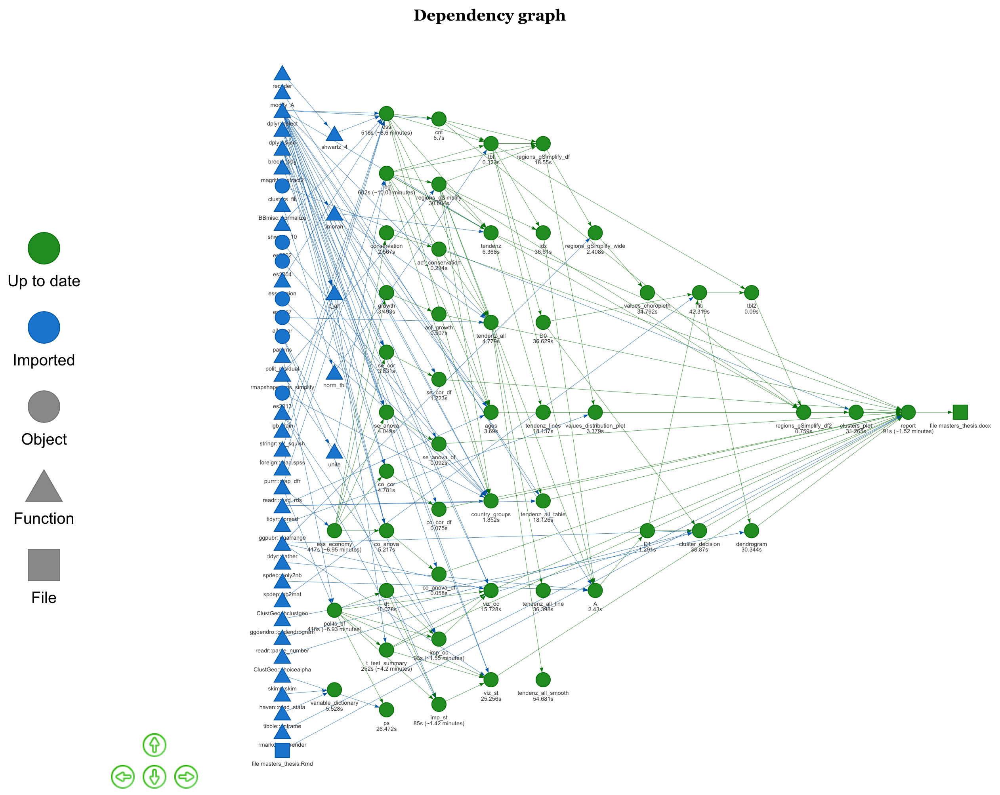

# Geographical distribution of social values in Europe: factors and patterns

Files for creating my master's research

Main file - **masters_thesis_plan.R** that contain drake plan.

Visualization of my drake plan:

- **politica_data.R** - file for preparing data to political analysis, which included reading data from DPI and joining with ESS data (1-8 round)
- **predef.R** - file with predefined lists and objects
- **functions.R** -  file with main function for analysis
- **masters_thesis.Rmd** - markdown file for creating **masters_thesis.docx**
- **sage_harvard_edited.csl** - file with references
- **example2.dotx** - file with word styles